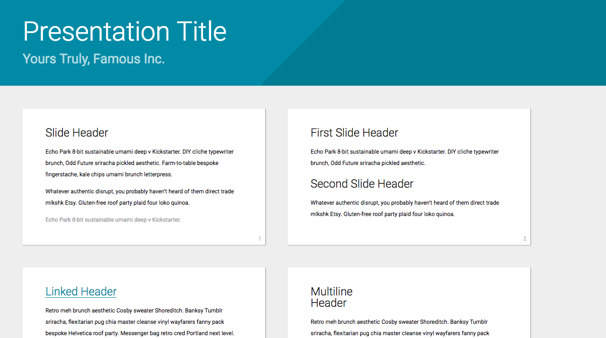

# My Customized theme for Shower
This theme is customized based on the [Shower's material theme][material
theme].  It adds code highlighting by Highlight.js and customized stylings.
[See it in action][gh-pages].

[](https://github.com/shower/material/actions/workflows/test.yml)



[material theme]: https://github.com/shower/material
[gh-pages]: https://blog.liang2.tw/my_shower_theme/


Get the Shower template where Ribbon is already included. Download the [template archive](https://shwr.me/shower.zip) or create a slide deck via [CLI tool](https://github.com/shower/cli). It requires [Node.js](https://nodejs.org/) installed.

	npx @shower/cli create

Wait for the installation and choose the **material** option in the wizard and you’re all set.

    npm start

All theme’s features are demonstrated in the [index.html](index.html) file, [see it live](https://shwr.me/shower/themes/material/). Use it as a reference while building your presentation. See more detailed [features overview](https://github.com/shower/shower/blob/main/docs/features.md).

Material theme supports any slide ratio you want. But it’s optimized for the most common ones: 16×9 and 4×3. It’s 16×9 by default, but you can change it by adjusting `--slide-ratio` property for `.shower`, [see example](https://github.com/shower/ribbon/blob/main/index.html#L10) in `index.html`.

    npm run publish

You can export slides to PDF by printing it via built-in dialog in Chromium-based browsers or via CLI tool. See [printing documentation](https://github.com/shower/shower/blob/main/docs/pdf.md) for more options.

```css
.shower {
    --color-key: #008aa5;
}
```


## License
The theme template is shared under MIT license, which is based on the following packages:

- [shower]: HTML5 slideshow framework by Vadim Makeev *et al.*, MIT license
- [shower's material theme][material theme] under [MIT License](LICENSE.md)
- [highlight.js]: Syntax highlight library by Ivan Sagalaev *et al.*, MIT license

[shower]: https://github.com/shower/shower
[highlight.js]: http://highlightjs.org/
