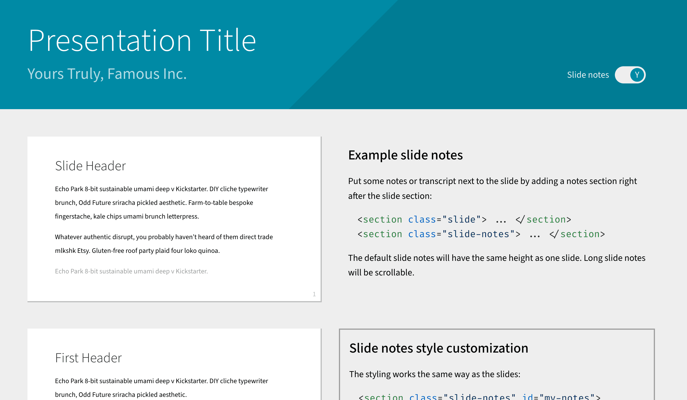
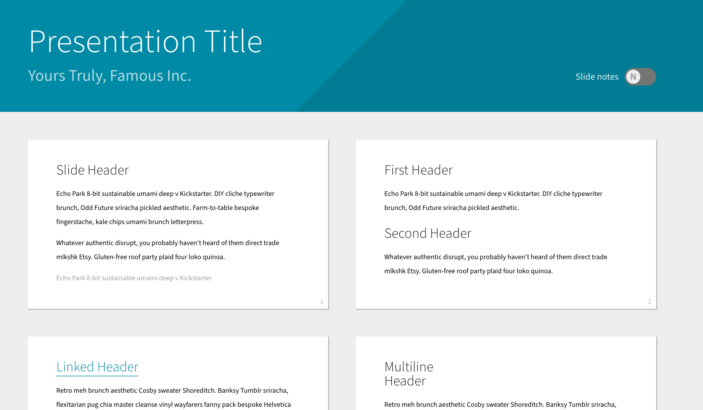

# My customized theme for Shower HTML presentation
[][workflow-status]

This theme is based on the [Shower's material theme][material
theme].
It adds toggleable slide notes, code highlighting, LaTeX rendering, and some other customized styles.
[See it in action][gh-pages].

| Slide notes shown | Slide notes hidden |
|-------------------|--------------------|
|  |  |

All the features of the official Shower themes are supported, so check out [the overview of their features](https://github.com/shower/shower/blob/main/docs/features.md) for the general usage of Shower presentation engine and how to modify the theme variables.

[material theme]: https://github.com/shower/material
[gh-pages]: https://blog.liang2.tw/my_shower_theme/
[workflow-status]: https://github.com/ccwang002/my_shower_theme/actions/workflows/publish.yml

## How to use this theme without setup
To use this theme without any setup (e.g., npm, git repo), download and extract the artifact (`slides.zip`) from [the latest workflow output][workflow-status].
Open `index.html` to start the presentation.
This folder serves as a standalone and offline presentation.
Develop the presentation by modifying `index.html` and other related files as needed.

## How to set up this theme
To set up this theme with development friendly features, fork or download the source code of this repository.

To set up, node.js is required:

    npm install     # Install the dependencies
    npm start       # Start live reloading by browsersync
    npm test        # Run CSS style check using stylelint

To create the standalone presentation bundle, run:

    npm run bundle

Modify the scripts at `scripts/bundle.sh` and `scripts/fix_npm_pkg_paths.sed` to include additional npm packages or files at different folders.

To publish the bundled presentation to GitHub Pages, run:

    npm run publish

This repo also sets up the GitHub workflow that will automatically bundle and publish the presentations on every git push.

## License
The theme is shared under [MIT license](LICENSE.md).
It directly modifies the official [Material][material theme] theme ([the original license][material-orig-license]) and will be in sync with upstream updates.

The theme builds on the following packages and resources:

- Shower's official theme, [Material][material theme], [MIT License][material-orig-license]
- [Shower]: HTML5 presentation framework by Vadim Makeev *et al.*, MIT license
- [highlight.js]: Code highlighting library by Ivan Sagalaev *et al.*, MIT license
- [KaTeX]: LaTeX math rendering, MIT license
- Fonts:
    - [Source Sans]: SIL Open Font License 1.1
    - [Fira Code]: SIL Open Font License 1.1

[material-orig-license]: LICENSE.shower_material.md
[shower]: https://github.com/shower/shower
[highlight.js]: http://highlightjs.org/
[KaTeX]: https://github.com/KaTeX/KaTeX
[Source Sans]: https://github.com/adobe-fonts/source-sans
[Fira Code]: https://github.com/tonsky/FiraCode
